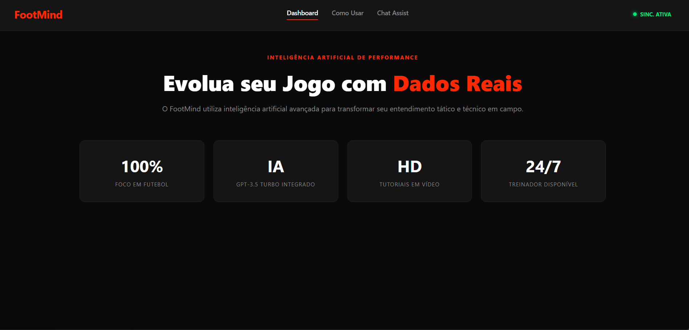
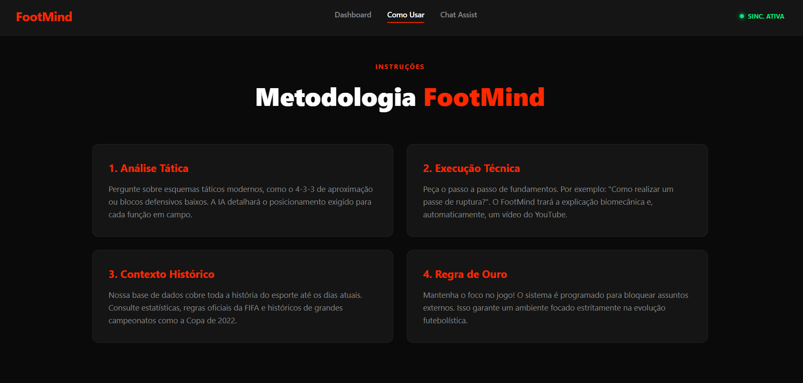
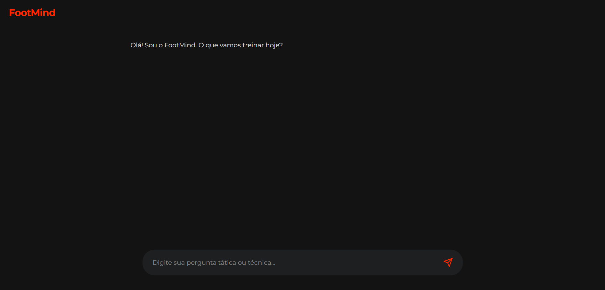

# Projeto

Descrição curta do que é o projeto.

O FootMind é um chat assistente 100% focado em futebol.

---

## Tecnologias usadas

- Node.js
- JavaScript
- API da OpenAI
- API do Youtubev ( Youtube data v3 )
- HTML / CSS

---

## Como rodar o projeto

Clone o repositório:
git clone https://github.com/vnzx09/FootMind#

Entre na pasta:
cd seu-repo

Instale as dependências:
npm install

Inicie o servidor:
node server.js

---

## Variáveis de ambiente

Crie um arquivo `.env` e adicione:

- OPENAI_API_KEY=suachaveaqui

- YOUTUBE_API_KEY=suachaveaqui

---

## Demonstração

---

## Funcionalidades

- Chatbot inteligente
- Busca de vídeos automaticamente
- Interface simples

---

## Licença

Este projeto é para fins de estudo / comercialização.